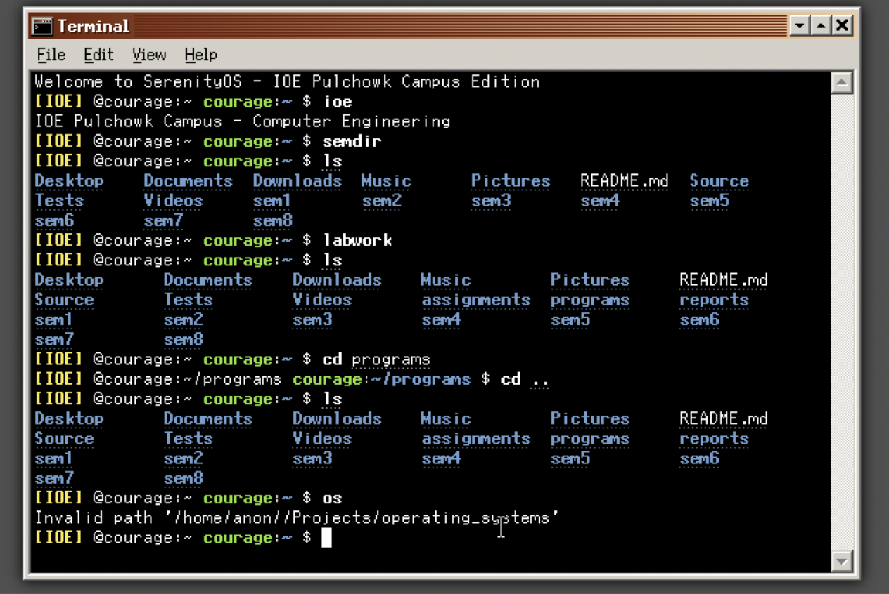
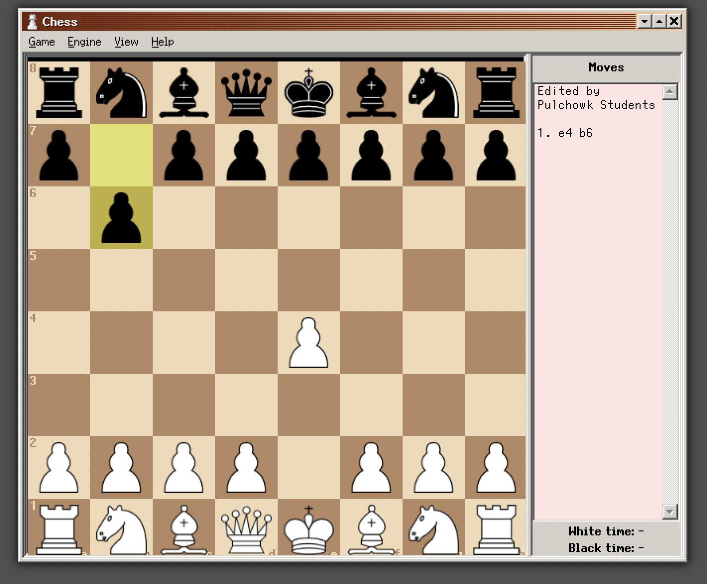
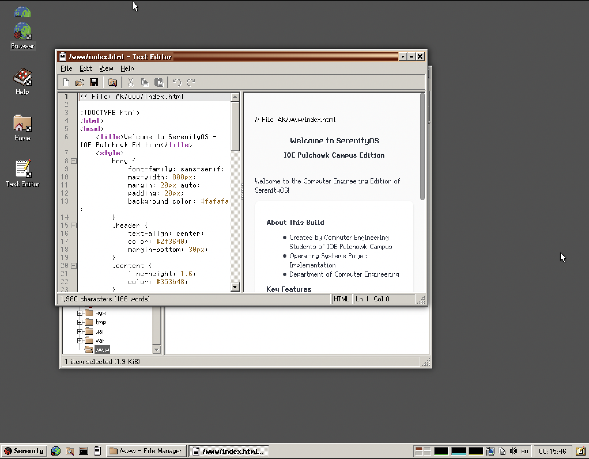
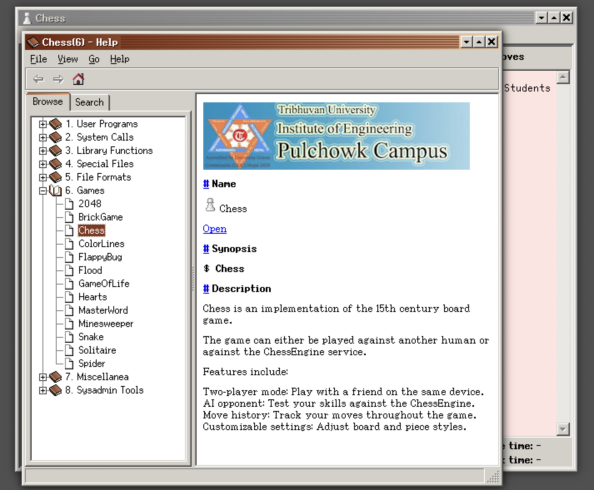
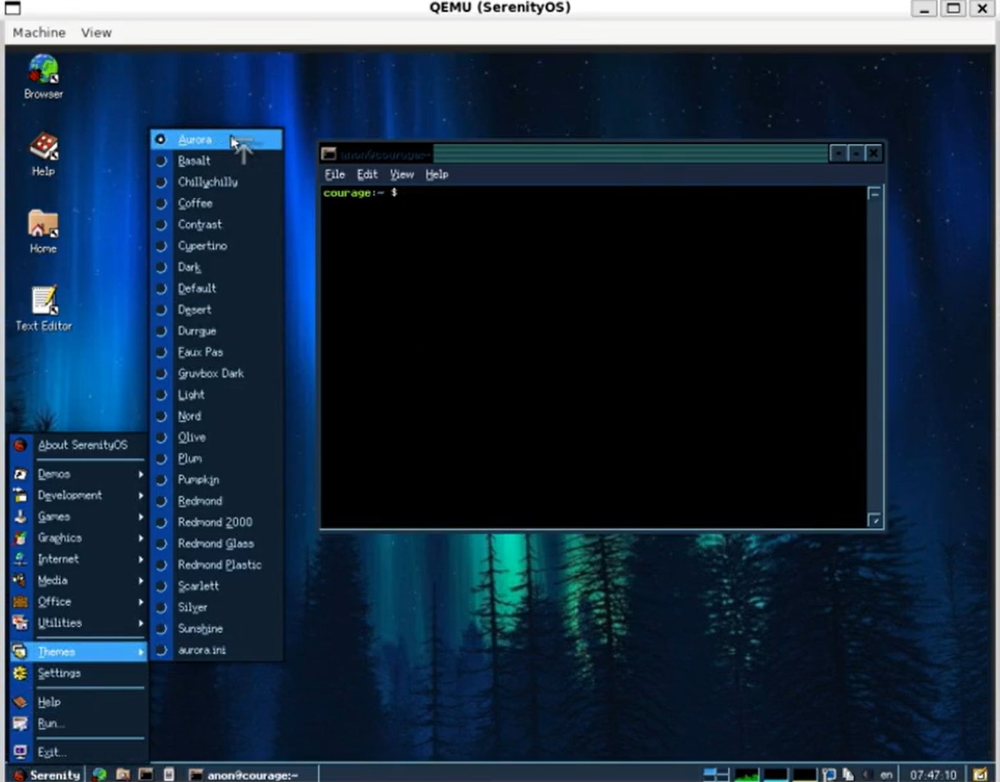

# SerenityOS

Graphical Unix-like operating system for 64-bit x86, Arm, and RISC-V computers.

[](https://github.com/SerenityOS/serenity/actions?query=workflow%3A"Build%2C%20lint%2C%20and%20test")
[](https://bugs.chromium.org/p/oss-fuzz/issues/list?sort=-opened&can=1&q=proj:serenity)
[](https://discord.gg/serenityos)

[FAQ](Documentation/FAQ.md) | [Documentation](#how-do-i-read-the-documentation) | [Build Instructions](#how-do-i-build-and-run-this)

## About

Welcome to my customized fork of SerenityOS! 🎉 SerenityOS is a Unix-like operating system for desktop computers, inspired by the look and feel of the late 1990s. In this fork, we’ve made some exciting changes to enhance functionality and personalization.


## Screenshots

  
 
 

## 🛠️ Key Customizations

### 1. **Terminal Enhancements**
- Improved user prompts for better clarity.
- Added custom command shortcuts for frequently used operations.
- Pulchowk Campus branding in terminal startup messages.

### 2. **Chess Game Updates**
- **Help Menu Updates**:
  - Detailed rules and controls for Chess in the Help section.
  - Pulchowk Campus logo integrated to highlight contributions.
  - Enhanced synopsis and features list.
- **UI Improvements**:
  - Background color updated to a light pink for a fresh look.
  - Styled move history display for clarity and accessibility.
    
### 3. **New Theme: Aurora**
- **Aurora Theme**:
  - Introduced a new **Aurora** theme, designed with a gradient effect inspired by northern lights.
  - Aurora theme customization available under settings to toggle between default and Aurora for enhanced personalization.
  - Includes new font styles and icons for a more modern look.
    
### 4. **Web Links Customization**
- Updated web links in the Help section to include:
  - SerenityOS official documentation.
  - Chess resources for beginners and advanced players.
  - Feedback and issue reporting on GitHub.

---

##  How to Build and Run

Follow these steps to build and run this fork of SerenityOS:

1. Clone the repository:
   ```sh
   git clone https://github.com/sadhanapanthi/serenity.git
   cd serenity
```

2. Run the build setup script

```sh
   ./Meta/serenity.sh rebuild-toolchain
```


3. Build SerenityOS:

```sh
   ./Meta/serenity.sh build
```

4. Run the OS:

```sh
./Meta/serenity.sh run
```

## 📂 File Changes Overview

### Updated Files:
#### Chess Game:
- `Userland/Games/Chess/ChessWidget.cpp`
- `Base/res/icons/pulchowk_logo.png`
- `Base/usr/share/man/man6/Chess.md`

#### Terminal:
- `Base/etc/shellrc`

#### Web Links:
- `Base/www/index.html`

### Added Files:
- Pulchowk Campus logo: `Base/res/icons/pulchowk.jpg`

## How do I read the documentation?

Man pages are available online at [man.serenityos.org](https://man.serenityos.org). These pages are generated from the Markdown source files in [`Base/usr/share/man`](https://github.com/SerenityOS/serenity/tree/master/Base/usr/share/man) and updated automatically.

When running SerenityOS you can use `man` for the terminal interface, or `help` for the GUI.

Code-related documentation can be found in the [documentation](Documentation/) folder.


## Contributors

-   **Sadhana Panthi** 
-   **Samikshya Bhusal** 
-   **Shreya Shrestha** 


## License

SerenityOS is licensed under a 2-clause BSD license.
